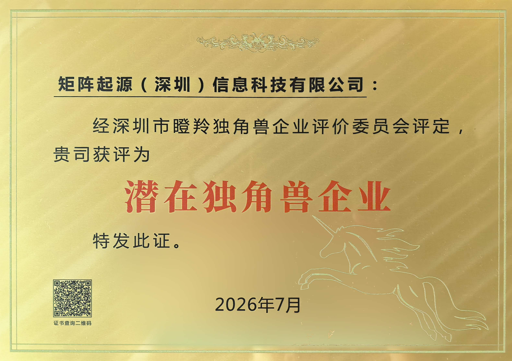

# 喜报丨矩阵起源荣获2026深圳市“潜在独角兽企业”称号

> 矩阵起源在2026中国（深圳）独角兽企业大会上荣获“潜在独角兽企业”称号，标志着公司的技术创新实力、成长潜力与市场价值再次获得权威认可。

近日，由**深圳市工业和信息化局、深圳市中小企业服务局、深圳市南山区人民政府指导**，以“**十年聚变·硬核领航·共赴新程**”为主题的2026中国（深圳）独角兽企业大会在深圳南山区盛大举行。大会现场揭晓了深圳市瞪羚独角兽企业系列榜单，目前深圳拥有独角兽企业47家、**潜在独角兽企业167家**、种子独角兽企业278家、瞪羚企业401家。

经**深圳市瞪羚独角兽企业评价委员会**评定，矩阵起源（深圳）信息科技有限公司凭借在数据智能（Data & AI）领域持续积累的技术实力、创新能力与发展潜力，荣获“**潜在独角兽企业**”称号。

此次获评“潜在独角兽企业”，是矩阵起源**继2025年获评**“**深圳市种子独角兽企业**”后，在深圳独角兽企业梯度培育体系中的**再次进阶**，此次进阶充分体现了社会各界对矩阵起源研发实力、商业前景与高成长性的认可。

面向AI时代，矩阵起源将继续以技术创新为驱动力，聚焦“**从数据到可信Agent的统一平台**”这一发展方向，并以全新升级的企业级数智平台**MatrixOne Intelligence 5.0**（MOI 5.0）为核心载体，将数据、模型、记忆与可信Agent运行时统一于同一底座，贯通从原始数据治理、知识构建到可信Agent开发与生产运行的完整链路，帮助企业降低多套系统拼装带来的复杂度与不可控性，**推动Agent跨越从Demo到规模化生产的“最后一公里”**。，助力更多企业将AI技术真正转化为业务价值。